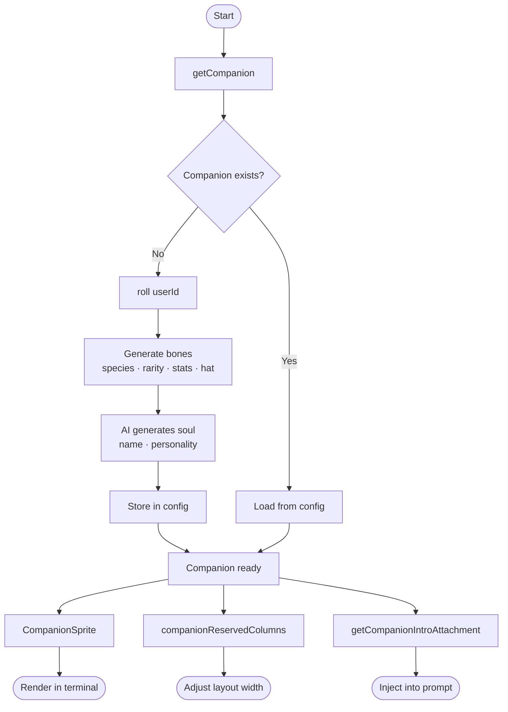

# Devmochi

```
  /\    /\        .-o-OO-o-.      .---.         _,--._
 ( ·    · )      (__________)     (·>·)         ( ·  · )
 (   ..   )         |·  ·|       /(   )\        /[______]\
  `------´          |____|        `---´          ``    ``
    chonk          mushroom       penguin          turtle
```

**Devmochi** is a tiny terminal companion that lives next to your CLI prompt. Each user gets a unique creature — determined by their ID — with its own rarity, stats, and personality.

---

## Species

| | Name | | Name | | Name |
|---|---|---|---|---|---|
| 🦆 | duck | 🐙 | octopus | 🌵 | cactus |
| 🪿 | goose | 🦉 | owl | 🤖 | robot |
| 🫧 | blob | 🐧 | penguin | 🐇 | rabbit |
| 🐱 | cat | 🐢 | turtle | 🍄 | mushroom |
| 🐉 | dragon | 🐌 | snail | 😺 | chonk |
| 👻 | ghost | 🦎 | axolotl | 🐾 | capybara |

---

## Rarity

| Rarity | Weight | Stars |
|--------|--------|-------|
| Common | 60% | ★ |
| Uncommon | 25% | ★★ |
| Rare | 10% | ★★★ |
| Epic | 4% | ★★★★ |
| Legendary | 1% | ★★★★★ |

---

## Usage



---

## Stats

Every companion has 5 stats rolled at creation:

| Stat | Description |
|------|-------------|
| `DEBUGGING` | How good at finding bugs |
| `PATIENCE` | Tolerance for long tasks |
| `CHAOS` | Tendency to cause trouble |
| `WISDOM` | General knowledge |
| `SNARK` | Level of commentary |

---

## Install

```bash
bun add github:RAPIDENN/Devmochi
```

---

## Quick start

```ts
import { getCompanion, CompanionSprite } from 'devmochi'

// Get companion for current user
const companion = getCompanion()
console.log(companion?.name, companion?.species, companion?.rarity)

// Render in terminal (Ink)
<CompanionSprite />
```
